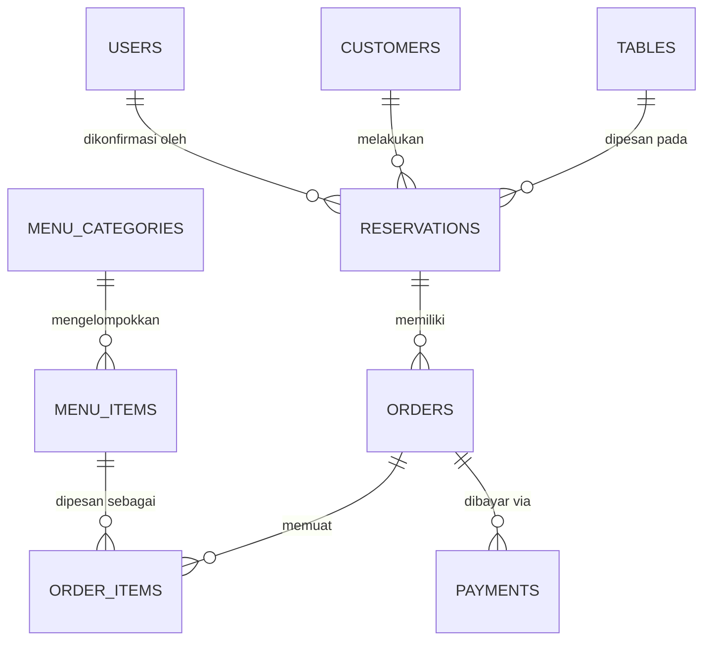

# Skema Basis Data PostgreSQL SiBangku (Multi-Tenant Architecture)

Dokumen ini memuat spesifikasi lengkap arsitektur dan skema basis data PostgreSQL yang digunakan oleh platform SiBangku.

---

## 1. Arsitektur Isolasi: Database-per-Tenant

Platform SiBangku memisahkan data dengan pendekatan **Physical Database-per-Tenant Isolation**:
1. **Control Plane Database (`sibangku_control`)**: Menyimpan direktori tenant, akun platform Super Admin, lisensi/langganan, dan audit trail lintas tenant.
2. **Tenant Database (`sibangku_tenant_<slug>`)**: Basis data independen yang dibuat secara otomatis saat tenant di-provisioning. Memuat data operasional restoran (meja, denah, menu, pesanan, reservasi, pengguna staf, dan pengaturan kustom).

---

## 2. Skema Basis Data Control Plane (`sibangku_control`)

### A. Tabel `tenants`
Menyimpan identitas, status lisensi, nama database fisik, dan pengenal aplikasi tenant.

| Nama Kolom | Tipe Data | Keterangan |
| :--- | :--- | :--- |
| `TenantId` | `VARCHAR(36)` (PK) | UUID unik pengenal tenant |
| `TenantCode` | `VARCHAR(50)` (Unique) | Kode unik huruf kapital (misal: `BISTRO-PRIME`) |
| `TenantName` | `VARCHAR(150)` | Nama entitas legal perusahaan pemilik |
| `RestaurantName` | `VARCHAR(150)` | Nama brand restoran yang tampil ke tamu |
| `Status` | `VARCHAR(30)` | Status: `ACTIVE`, `TRIAL`, `SUSPENDED`, `TRIAL_EXPIRED` |
| `SubscriptionStatus` | `VARCHAR(30)` | Status langganan: `ACTIVE`, `TRIAL`, `EXPIRED` |
| `TrialStart` | `TIMESTAMP WITH TIME ZONE` | Waktu dimulainya masa aktif |
| `TrialEnd` | `TIMESTAMP WITH TIME ZONE` | Tenggat waktu aktif (tenggat bayar/kedaluwarsa) |
| `DatabaseIdentifier` | `VARCHAR(100)` | Nama fisik DB PostgreSQL (misal: `sibangku_tenant_bistro`) |
| `StorageIdentifier` | `VARCHAR(100)` | ID bucket penyimpanan aset (logo, banner) |
| `WebIdentifier` | `VARCHAR(255)` | Domain / subdomain web tenant |
| `ApkIdentifier` | `VARCHAR(255)` | Package ID aplikasi mobile (misal: `com.sibangku.bistro`) |
| `CreatedAt` | `TIMESTAMP WITH TIME ZONE` | Waktu pembuatan tenant |
| `UpdatedAt` | `TIMESTAMP WITH TIME ZONE` | Waktu pembaruan profil/status |

### B. Tabel `platform_users`
Menyimpan kredensial Super Admin pengelola platform SiBangku.

| Nama Kolom | Tipe Data | Keterangan |
| :--- | :--- | :--- |
| `UserId` | `VARCHAR(36)` (PK) | UUID unik pengguna platform |
| `Email` | `VARCHAR(150)` (Unique) | Email login Super Admin |
| `PasswordHash` | `VARCHAR(255)` | Hash kata sandi menggunakan BCrypt (10 rounds) |
| `DisplayName` | `VARCHAR(100)` | Nama tampilan Super Admin |
| `Role` | `VARCHAR(50)` | Hak akses: `SUPER_ADMIN` |
| `IsActive` | `BOOLEAN` | Status aktif akun |
| `CreatedAt` | `TIMESTAMP WITH TIME ZONE` | Waktu pembuatan akun |

### C. Tabel `audit_logs`
Menyimpan jejak audit seluruh aktivitas manajerial dan pembaruan lisensi/langganan.

| Nama Kolom | Tipe Data | Keterangan |
| :--- | :--- | :--- |
| `Id` | `VARCHAR(36)` (PK) | UUID log |
| `TenantId` | `VARCHAR(36)` | Relasi ke tenant (opsional) |
| `Action` | `VARCHAR(100)` | Aksi: `provision tenant`, `lock subscription`, `extend trial` |
| `UserId` | `VARCHAR(100)` | Pengguna / sistem yang mengeksekusi aksi |
| `Details` | `TEXT` (JSON) | Payload rincian aksi dalam format JSON |
| `CreatedAt` | `TIMESTAMP WITH TIME ZONE` | Waktu pencatatan log audit |

---

## 3. Skema Basis Data Tenant (`sibangku_tenant_<slug>`)

Setiap tenant memiliki skema relasional lengkap berikut:

### A. Tabel `tables` (Manajemen Meja & Denah)
- `TableId` (`VARCHAR(36)` PK)
- `TableNumber` (`VARCHAR(20)`) - Nomor meja (misal: "01", "VIP-A")
- `Shape` (`VARCHAR(20)`) - Bentuk visual meja: `SQUARE`, `ROUND`, `RECTANGLE`
- `Capacity` (`INT`) - Jumlah kursi / kapasitas tamu
- `PosX`, `PosY` (`DOUBLE PRECISION`) - Koordinat denah meja visual
- `Rotation` (`INT`) - Sudut putar meja pada canvas
- `IsActive` (`BOOLEAN`) - Status ketersediaan meja
- `CreatedAt`, `UpdatedAt` (`TIMESTAMP WITH TIME ZONE`)

### B. Tabel `reservations` (Transaksi Pemesanan Meja)
- `ReservationId` (`VARCHAR(36)` PK)
- `ReservationCode` (`VARCHAR(50)` Unique) - Kode tiket (misal: `SBK-2026-XXXX`)
- `TableId` (`VARCHAR(36)` FK) - Referensi ke tabel `tables`
- `CustomerId` (`VARCHAR(36)` FK) - Referensi ke tabel `customers`
- `GuestCount` (`INT`) - Jumlah tamu yang hadir
- `ReservationDate` (`DATE`) - Tanggal kedatangan
- `StartTime`, `EndTime` (`TIME`) - Rentang slot jam kedatangan
- `Status` (`VARCHAR(30)`) - Status: `PENDING`, `CONFIRMED`, `CHECKED_IN`, `COMPLETED`, `CANCELLED`, `NO_SHOW`
- `QrCodeData` (`TEXT`) - Payload token QR Code untuk scan check-in
- `Notes` (`TEXT`) - Catatan khusus tamu
- `CreatedAt`, `UpdatedAt` (`TIMESTAMP WITH TIME ZONE`)

### C. Tabel `customers` (Buku Tamu / Pelanggan)
- `CustomerId` (`VARCHAR(36)` PK)
- `Name` (`VARCHAR(150)`) - Nama pelanggan
- `Email` (`VARCHAR(150)`) - Email konfirmasi e-tiket
- `Phone` (`VARCHAR(50)`) - Nomor WhatsApp / telepon
- `CreatedAt` (`TIMESTAMP WITH TIME ZONE`)

### D. Tabel `menu_categories` & `menu_items` (Katalog Menu Restoran)
- **`menu_categories`**: `CategoryId` (PK), `Name`, `DisplayOrder`, `IsActive`.
- **`menu_items`**: `ItemId` (PK), `CategoryId` (FK), `Name`, `Description`, `Price` (`DECIMAL`), `ImageUrl`, `IsAvailable`, `StockCount`.

### E. Tabel `orders`, `order_items`, `payments` (Pre-Order & Transaksi)
- **`orders`**: `OrderId` (PK), `ReservationId` (FK), `TotalAmount`, `Status`.
- **`order_items`**: `OrderItemId` (PK), `OrderId` (FK), `ItemId` (FK), `Quantity`, `UnitPrice`, `Subtotal`.
- **`payments`**: `PaymentId` (PK), `OrderId` (FK), `PaymentMethod` (QRIS, VA, Tunai), `Amount`, `Status`, `TransactionTime`.

### F. Tabel `users` (Staf & Administrator Restoran)
- `UserId` (`VARCHAR(36)` PK)
- `TenantId` (`VARCHAR(36)`)
- `Email` (`VARCHAR(150)` Unique) - Email login admin resto
- `PasswordHash` (`VARCHAR(255)`) - Hash BCrypt
- `Name` (`VARCHAR(100)`) - Nama staf / pemilik
- `Role` (`VARCHAR(50)`) - `TENANT_ADMIN`, `MANAGER`, `CASHIER`, `WAITER`
- `MustChangePassword` (`BOOLEAN`)
- `CreatedAt` (`TIMESTAMP WITH TIME ZONE`)

### G. Tabel `settings` (Konfigurasi & Dynamic Customization)
Menyimpan modifikasi per-tenant (branding warna, jam buka, custom CSS, integrasi) dalam bentuk pasangan Key-Value ringan:
- `Key` (`VARCHAR(100)` PK)
- `Value` (`TEXT`) - JSON payload atau string CSS kustom

---

## 4. Mekanisme Keamanan & Otomasi Tenggat

1. **Auto-Lock Waktu Tenggat (Worker Daemon):**
   - Background worker memeriksa seluruh tenant dengan interval berkala.
   - Jika `tenant.TrialEnd < DateTime.UtcNow`, status tenant langsung diubah menjadi `TRIAL_EXPIRED`.
2. **Enforcement Middleware (`TenantResolutionMiddleware`):**
   - Setiap permintaan HTTP yang masuk ke tenant dengan status bukan `ACTIVE` atau `TRIAL` secara otomatis ditolak dengan kode status **`403 Forbidden` (`TENANT_EXPIRED`)**.
   - Hal ini menjamin perlindungan akses instan begitu masa berlangganan mitra berakhir sampai statusnya diperpanjang oleh Super Admin.
